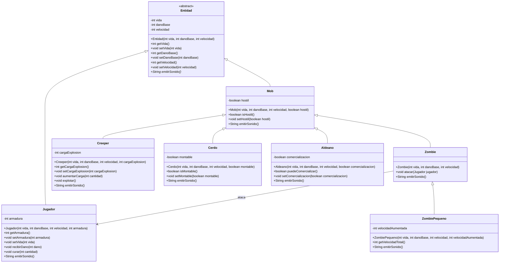

# rsantacruz-taller-git-2026

API REST del modelado de entidades de **Minecraft** (Lenguaje de Programación 3, 2026).

## Levantar

```bash
./mvnw spring-boot:run
```

Abre en `http://localhost:8080`.

| Endpoint | Qué hace |
|---|---|
| `GET /` | Confirma que el servicio está vivo |
| `GET /api/minecraft/construir?tipo=creeper&vida=20&danoBase=6&velocidad=3&valorExtra=24` | Construye una entidad por URL (si el valor es ilegal, la clase lo rechaza con `400`) |
| `GET /api/minecraft/sonidos` | JSON con el sonido que informa cada hija (tratadas como `Entidad`) |

---

## Diagrama de clases (2 y 3 de septiembre, actualizado)



`*` = método abstracto. `<<abstract>>` = clase abstracta.

---

## Jerarquía

```text
Entidad (abstracta)
├── Jugador
└── Mob
    ├── Zombie
    │   └── ZombiePequeno
    ├── Creeper
    ├── Cerdo
    └── Aldeano
```

## Encapsulamiento

Todos los atributos son `private`; el estado cambia por mensajes: los `set` validan antes de modificar y el constructor deja el objeto válido.

No se permite `jugador.vida = 100`; se usa `jugador.setVida(100)` y la clase decide si es legal.

## Reglas de validación

| Clase | Regla |
|---|---|
| `Entidad` | vida, daño base y velocidad no negativos |
| `Jugador` | vida máxima 20; armadura no negativa |
| `Creeper` | carga de explosión no negativa; la carga solo aumenta con valores positivos |
| `ZombiePequeno` | velocidad aumentada no negativa |

## Conceptos de POO aplicados

- **Encapsulamiento:** atributos privados, acceso por mensajes controlados.
- **Herencia:** `Entidad → Mob → Zombie → ZombiePequeno`, etc.
- **Sobrescritura:** `Jugador` sobrescribe `setVida()` para imponer su límite de 20; cada hija sobrescribe `emitirSonido()`.
- **Polimorfismo:** el controller pide `emitirSonido()` a cada entidad por el tipo padre `Entidad`, sin `if` por tipo.
- **Método abstracto:** `Entidad.emitirSonido()` declara un comportamiento común cuya forma concreta depende de cada hija.
- **Especialización:** cada subclase agrega su característica (armadura, carga de explosión, montable, comercialización, velocidad aumentada).

## Estructura del código

```text
src/main/java/py/edu/uc/lp3/rs/minecraft/
├── …/MinecraftApplication.java
├── modelo/   (Entidad, Mob, Jugador, Zombie, ZombiePequeno, Creeper, Cerdo, Aldeano, FabricaEntidades)
└── web/      (IndexController, ConstruccionController, SonidoController)
```

## Visualización del diagrama

El bloque Mermaid se renderiza solo en GitHub y puede editarse en https://mermaid.live.

## Licencia

Apache License 2.0 — ver `LICENSE`.